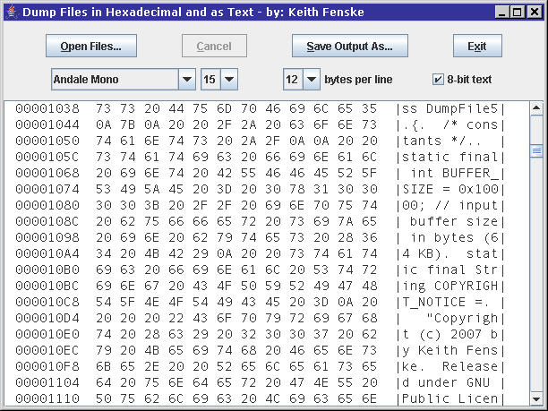

### Dump File (Java)

by: Keith Fenske, https://kwfenske.github.io/

DumpFile is a Java 1.4 application to dump (display) the contents of entire
files in hexadecimal and as 8-bit text bytes. Output is shown in a scrolling
text area, and can be saved to a new file or copied from the text area.

Download the ZIP file here: https://kwfenske.github.io/dump-file-java.zip

Released under the terms and conditions of the Apache License (version 2.0 or
later) and/or the GNU General Public License (GPL, version 2 or later).

Please see the HexView application, which is better for most users:
https://github.com/kwfenske/hex-file-viewer-java
